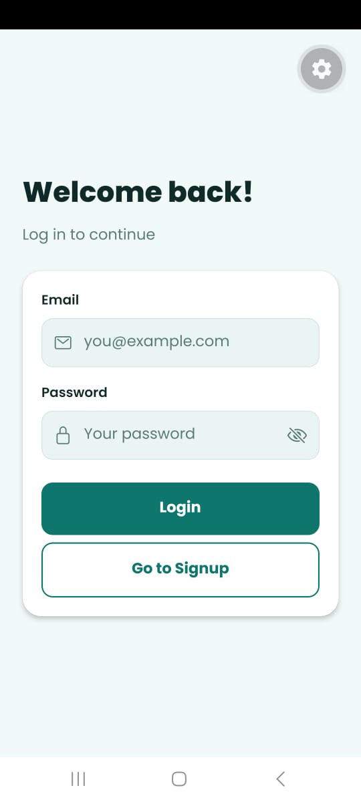
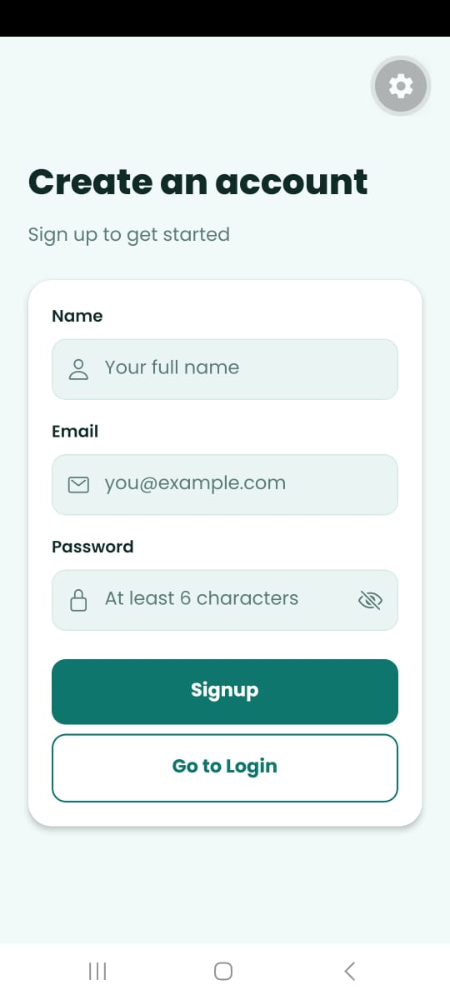
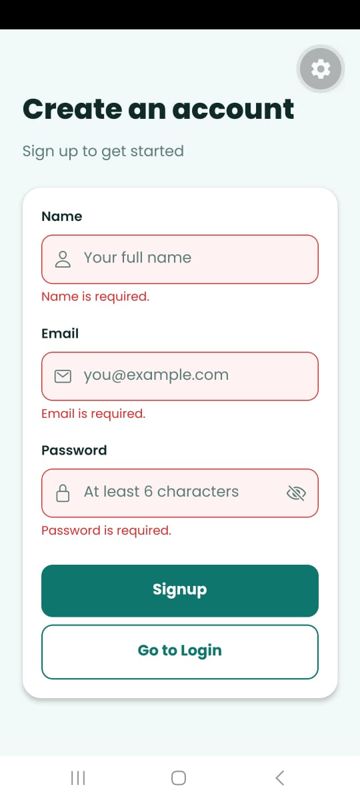
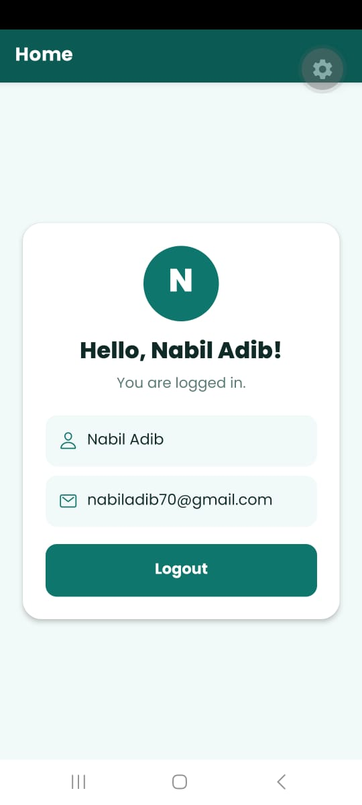

# React Native Auth App

A React Native (Expo) app with Login, Signup and Home screens. Authentication is managed with React's Context API, saved with AsyncStorage, and screens are connected with React Navigation.

## Screenshots

| Login | Signup | Errors | Home |
|-------|--------|--------|------|
|  |  |  |  |

## Setup

You need **Node.js** installed and the **Expo Go** app on your phone.

```bash
git clone https://github.com/nebneb97/REPO_NAME.git
cd REPO_NAME
npm install
npx expo start
```

Scan the QR code with Expo Go (Android) or the Camera app (iOS).

## Features

- **AuthContext:** provides `user`, `login`, `signup` and `logout` to the whole app.
- **Login screen:** email and password fields, with errors for invalid format and incorrect credentials.
- **Signup screen:** name, email and password fields, with errors for missing fields, invalid email and passwords shorter than 6 characters.
- **Home screen:** shows the user's name and email, with a Logout button.
- **Navigation:** React Navigation shows Login/Signup when logged out and Home when logged in.
- **Stay logged in:** the session is saved with AsyncStorage, so the user stays logged in after reopening the app.
- **Password toggle (bonus):** an eye icon shows or hides the password.

## Project Structure

```
App.js
src/
  components/   FormInput, PrimaryButton
  context/      AuthContext
  navigation/   AppNavigator
  screens/      Login, Signup, Home
  utils/        validation
  theme.js
```

## Tech Stack

React Native (Expo), Context API, React Navigation, AsyncStorage

> Note: this is a demo without a backend. User accounts are stored locally on the device.